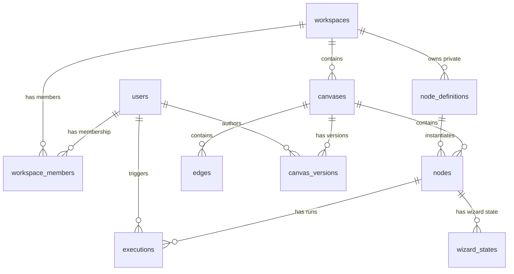

# 02 — Database Schema

## ER Diagram



---

## Tables

### `users`
| Column | Type | Constraints | Notes |
|---|---|---|---|
| `id` | `UUID` | PK, default `gen_random_uuid()` | |
| `email` | `VARCHAR(255)` | UNIQUE, NOT NULL | |
| `name` | `VARCHAR(255)` | NOT NULL | |
| `password_hash` | `VARCHAR(255)` | NULLABLE | NULL if OAuth-only |
| `avatar_url` | `TEXT` | NULLABLE | |
| `oauth_provider` | `VARCHAR(50)` | NULLABLE | `google`, `github` |
| `oauth_provider_id` | `VARCHAR(255)` | NULLABLE | |
| `created_at` | `TIMESTAMPTZ` | NOT NULL, default `now()` | |
| `updated_at` | `TIMESTAMPTZ` | NOT NULL, default `now()` | |

### `workspaces`
| Column | Type | Constraints | Notes |
|---|---|---|---|
| `id` | `UUID` | PK | |
| `name` | `VARCHAR(255)` | NOT NULL | |
| `slug` | `VARCHAR(100)` | UNIQUE, NOT NULL | URL-safe identifier |
| `plan` | `VARCHAR(50)` | NOT NULL, default `'free'` | `free`, `pro`, `enterprise` |
| `api_keys` | `JSONB` | NOT NULL, default `'{}'` | Encrypted blob: `{ anthropic, openai, google }` |
| `llm_default_config` | `JSONB` | NOT NULL | `{ provider, model, temperature, max_tokens, system_prompt }` |
| `monthly_cost_limit_usd` | `DECIMAL(10,2)` | NULLABLE | |
| `created_at` | `TIMESTAMPTZ` | NOT NULL, default `now()` | |
| `updated_at` | `TIMESTAMPTZ` | NOT NULL, default `now()` | |

### `workspace_members`
| Column | Type | Constraints | Notes |
|---|---|---|---|
| `workspace_id` | `UUID` | PK (composite), FK → workspaces | |
| `user_id` | `UUID` | PK (composite), FK → users | |
| `role` | `VARCHAR(20)` | NOT NULL, default `'member'` | `owner`, `admin`, `member` |
| `joined_at` | `TIMESTAMPTZ` | NOT NULL, default `now()` | |

### `canvases`
| Column | Type | Constraints | Notes |
|---|---|---|---|
| `id` | `UUID` | PK | |
| `workspace_id` | `UUID` | FK → workspaces, NOT NULL | |
| `name` | `VARCHAR(255)` | NOT NULL | |
| `template_id` | `VARCHAR(100)` | NULLABLE | Template used at creation |
| `viewport` | `JSONB` | NOT NULL, default `'{"x":0,"y":0,"zoom":1}'` | Pan/zoom state |
| `llm_config_override` | `JSONB` | NULLABLE | Canvas-level LLM override (level 2) |
| `created_by` | `UUID` | FK → users | |
| `created_at` | `TIMESTAMPTZ` | NOT NULL, default `now()` | |
| `updated_at` | `TIMESTAMPTZ` | NOT NULL, default `now()` | |

**Index**: `idx_canvases_workspace` ON (`workspace_id`)

### `nodes`
| Column | Type | Constraints | Notes |
|---|---|---|---|
| `id` | `UUID` | PK | |
| `canvas_id` | `UUID` | FK → canvases, NOT NULL | |
| `definition_id` | `UUID` | FK → node_definitions, NULLABLE | NULL for ad-hoc nodes |
| `type` | `VARCHAR(20)` | NOT NULL | `llm`, `input`, `output`, `custom` |
| `label` | `VARCHAR(255)` | NOT NULL | Display name |
| `position_x` | `FLOAT` | NOT NULL | |
| `position_y` | `FLOAT` | NOT NULL | |
| `width` | `FLOAT` | NOT NULL, default `300` | |
| `height` | `FLOAT` | NOT NULL, default `200` | |
| `config` | `JSONB` | NOT NULL, default `'{}'` | `{ prompt, llm_provider, model, temperature, max_tokens, system_prompt, output_format }` |
| `input_content` | `TEXT` | NULLABLE | Manual text input |
| `output_content` | `TEXT` | NULLABLE | Last LLM output |
| `state` | `VARCHAR(20)` | NOT NULL, default `'idle'` | `idle`, `running`, `done`, `error` |
| `error_message` | `TEXT` | NULLABLE | |
| `notes` | `TEXT` | NULLABLE | Hover notes |
| `is_collapsed` | `BOOLEAN` | NOT NULL, default `false` | |
| `wizard_current_step` | `INT` | NULLABLE | For wizard nodes only |
| `wizard_total_steps` | `INT` | NULLABLE | For wizard nodes only |
| `created_at` | `TIMESTAMPTZ` | NOT NULL, default `now()` | |
| `updated_at` | `TIMESTAMPTZ` | NOT NULL, default `now()` | |

**Index**: `idx_nodes_canvas` ON (`canvas_id`)

### `edges`
| Column | Type | Constraints | Notes |
|---|---|---|---|
| `id` | `UUID` | PK | |
| `canvas_id` | `UUID` | FK → canvases, NOT NULL | |
| `source_node_id` | `UUID` | FK → nodes, NOT NULL | |
| `target_node_id` | `UUID` | FK → nodes, NOT NULL | |
| `mode` | `VARCHAR(20)` | NOT NULL, default `'auto'` | `auto`, `manual`, `visual` |
| `created_at` | `TIMESTAMPTZ` | NOT NULL, default `now()` | |

**Indexes**: `idx_edges_canvas` ON (`canvas_id`), `idx_edges_source` ON (`source_node_id`), `idx_edges_target` ON (`target_node_id`)  
**Constraint**: `UNIQUE(source_node_id, target_node_id)` — no duplicate edges

### `node_definitions`
| Column | Type | Constraints | Notes |
|---|---|---|---|
| `id` | `UUID` | PK | |
| `workspace_id` | `UUID` | FK → workspaces, NULLABLE | NULL = public library |
| `node_id_code` | `VARCHAR(50)` | UNIQUE, NOT NULL | e.g. `NODE-PD-01` |
| `name` | `VARCHAR(255)` | NOT NULL | |
| `description` | `TEXT` | NULLABLE | |
| `category` | `VARCHAR(100)` | NOT NULL | Phase/domain category |
| `type` | `VARCHAR(20)` | NOT NULL | `llm`, `input`, `output`, `custom` |
| `is_wizard` | `BOOLEAN` | NOT NULL, default `false` | |
| `wizard_steps` | `INT` | NULLABLE | Number of wizard steps |
| `default_prompt` | `TEXT` | NOT NULL | |
| `default_llm_config` | `JSONB` | NOT NULL | `{ provider, model, temperature, max_tokens }` |
| `input_schema` | `JSONB` | NULLABLE | JSON Schema for expected inputs |
| `output_schema` | `JSONB` | NULLABLE | JSON Schema for expected outputs |
| `visibility` | `VARCHAR(20)` | NOT NULL, default `'private'` | `public`, `private` |
| `is_base` | `BOOLEAN` | NOT NULL, default `false` | Base nodes cannot be deleted |
| `forked_from_id` | `UUID` | FK → node_definitions, NULLABLE | |
| `version` | `INT` | NOT NULL, default `1` | |
| `tags` | `TEXT[]` | default `'{}'` | |
| `created_at` | `TIMESTAMPTZ` | NOT NULL, default `now()` | |
| `updated_at` | `TIMESTAMPTZ` | NOT NULL, default `now()` | |

**Index**: `idx_nodedefs_workspace` ON (`workspace_id`), `idx_nodedefs_visibility` ON (`visibility`)

### `canvas_versions`
| Column | Type | Constraints | Notes |
|---|---|---|---|
| `id` | `UUID` | PK | |
| `canvas_id` | `UUID` | FK → canvases, NOT NULL | |
| `snapshot_data` | `JSONB` | NOT NULL | Full or delta snapshot |
| `is_full_snapshot` | `BOOLEAN` | NOT NULL, default `false` | |
| `event_type` | `VARCHAR(50)` | NOT NULL | `auto`, `manual`, `node_add`, `node_remove`, `node_run`, `rollback` |
| `name` | `VARCHAR(255)` | NULLABLE | User-defined name for manual snapshots |
| `author_id` | `UUID` | FK → users, NOT NULL | |
| `created_at` | `TIMESTAMPTZ` | NOT NULL, default `now()` | |

**Index**: `idx_versions_canvas_time` ON (`canvas_id`, `created_at` DESC)  
**Retention**: Auto-snapshots older than 90 days deleted via cron; manual snapshots retained indefinitely.

### `executions`
| Column | Type | Constraints | Notes |
|---|---|---|---|
| `id` | `UUID` | PK | |
| `node_id` | `UUID` | FK → nodes, NOT NULL | |
| `canvas_id` | `UUID` | FK → canvases, NOT NULL | |
| `triggered_by` | `UUID` | FK → users, NOT NULL | |
| `llm_provider` | `VARCHAR(50)` | NOT NULL | |
| `model` | `VARCHAR(100)` | NOT NULL | |
| `tokens_in` | `INT` | NOT NULL, default `0` | |
| `tokens_out` | `INT` | NOT NULL, default `0` | |
| `cost_usd` | `DECIMAL(10,6)` | NOT NULL, default `0` | |
| `duration_ms` | `INT` | NOT NULL, default `0` | |
| `state` | `VARCHAR(20)` | NOT NULL | `pending`, `running`, `done`, `error` |
| `error_message` | `TEXT` | NULLABLE | |
| `created_at` | `TIMESTAMPTZ` | NOT NULL, default `now()` | |

**Index**: `idx_executions_node` ON (`node_id`), `idx_executions_canvas` ON (`canvas_id`)

### `wizard_states`
| Column | Type | Constraints | Notes |
|---|---|---|---|
| `id` | `UUID` | PK | |
| `node_id` | `UUID` | FK → nodes, UNIQUE, NOT NULL | 1:1 with node |
| `current_step` | `INT` | NOT NULL, default `0` | |
| `step_outputs` | `JSONB` | NOT NULL, default `'[]'` | Array of step outputs |
| `step_user_confirmations` | `JSONB` | NOT NULL, default `'[]'` | Timestamps of user confirmations |
| `gate_status` | `VARCHAR(20)` | NOT NULL, default `'pending'` | `pending`, `passed`, `failed` |
| `gate_questions` | `JSONB` | NULLABLE | Clarifying questions if gate fails |
| `updated_at` | `TIMESTAMPTZ` | NOT NULL, default `now()` | |

---

## Row-Level Security (RLS)

```sql
-- All data queries scoped to workspace
ALTER TABLE canvases ENABLE ROW LEVEL SECURITY;
CREATE POLICY workspace_isolation ON canvases
  USING (workspace_id IN (
    SELECT workspace_id FROM workspace_members WHERE user_id = current_setting('app.user_id')::uuid
  ));
-- Same pattern applied to: nodes, edges, canvas_versions, executions, node_definitions
```
