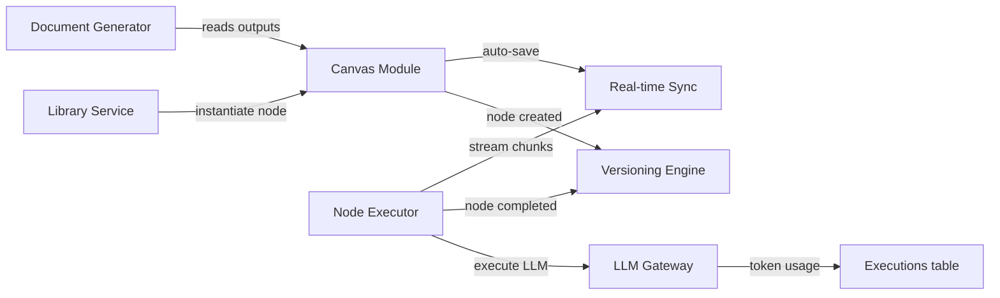

# 03 — Backend Services

## Service Architecture Overview

All services are **modules within a single Express.js application**, organized as domain-bounded packages under `src/modules/`. Each module owns its routes, controllers, services, and repository layer.

```
src/
├── modules/
│   ├── auth/            # Auth & Workspace
│   ├── canvas/          # Canvas Module
│   ├── nodes/           # Node system + Executor
│   ├── llm/             # LLM Gateway
│   ├── versioning/      # Versioning Engine
│   ├── library/         # Library Service
│   ├── documents/       # Document Generator
│   └── realtime/        # Real-time Sync (WebSocket)
├── shared/
│   ├── middleware/       # Auth, validation, error handling
│   ├── queue/           # BullMQ setup
│   ├── db/              # Prisma client, migrations
│   └── utils/           # Helpers, constants
└── server.ts            # Express + Socket.IO bootstrap
```

---

## Module Specifications

### 1. Auth & Workspace Module (`src/modules/auth/`)

**Responsibilities**: User registration/login, OAuth, JWT management, workspace CRUD, membership, API key storage

| Component | Details |
|---|---|
| **Auth Strategy** | Email/password (bcrypt) + Google OAuth via NextAuth |
| **Token Flow** | Short-lived access JWT (15min) + HttpOnly refresh token (7d) |
| **API Key Vault** | Workspace API keys encrypted with AES-256-GCM before DB storage; decryption only in LLM Gateway at execution time |
| **RBAC Roles** | `owner` (all permissions), `admin` (manage members, settings), `member` (canvas CRUD, execution) |

**Key Functions**:
- `register(email, password, name)` → User + default Workspace
- `login(email, password)` → JWT + refresh token
- `oauthCallback(provider, profile)` → JWT
- `createWorkspace(name, ownerId)` → Workspace
- `inviteMember(workspaceId, email, role)` → Membership
- `setApiKeys(workspaceId, keys)` → encrypted storage
- `getDecryptedApiKeys(workspaceId)` → plaintext keys (internal only)

---

### 2. Canvas Module (`src/modules/canvas/`)

**Responsibilities**: Canvas CRUD, node/edge management, auto-save, viewport state, template instantiation

| Component | Details |
|---|---|
| **Auto-save** | Debounced (2s) writes via Redis pub/sub; client sends diffs, server merges |
| **Template System** | Templates stored as JSON definitions; instantiation creates nodes + edges |
| **DAG Validation** | Topological sort on every edge addition; rejects cycles |

**Key Functions**:
- `createCanvas(workspaceId, templateId?, name)` → Canvas with nodes/edges if template
- `getCanvas(canvasId)` → Full canvas with nodes, edges, viewport
- `updateCanvas(canvasId, patch)` → Partial update (viewport, name, config)
- `deleteCanvas(canvasId)` → Soft delete
- `addNode(canvasId, nodeData)` → Node
- `updateNode(nodeId, patch)` → Node (position, config, content)
- `removeNode(nodeId)` → Cascade removes edges
- `addEdge(canvasId, edgeData)` → Edge (validates no cycles)
- `removeEdge(edgeId)`
- `autoSave(canvasId, deltaPayload)` → Debounced persist + version event

---

### 3. Node Executor (`src/modules/nodes/`)

**Responsibilities**: Queue management, execution lifecycle, cascading, wizard state machine, timeout/retry

| Component | Details |
|---|---|
| **Queue** | BullMQ queue `node-executions` with concurrency 5 |
| **Retry** | Max 3 retries, exponential backoff (2s, 4s, 8s), only on transient errors (5xx, timeout) |
| **Timeout** | Default 120s per node, configurable |
| **Cascade** | After node completion, find downstream nodes with `mode=auto` edges; enqueue in topological order |
| **Wizard FSM** | States: `gate_check` → `step_N_running` → `step_N_waiting` → ... → `completed` |

**Key Functions**:
- `executeNode(nodeId, userId)` → Enqueue single execution
- `executeCanvas(canvasId, userId)` → Topological sort → enqueue all
- `stopExecution(nodeId)` → Cancel running job
- `rerunNode(nodeId, userId)` → Confirm → execute
- `advanceWizard(nodeId, stepConfirmation)` → Next wizard step
- `getExecutionLog(nodeId)` → Execution[] history

**Wizard FSM Detail**:
```
[GATE_CHECK] → inputs sufficient? → YES → [STEP_1_RUNNING]
                                   → NO  → [GATE_QUESTIONS] → user answers → [GATE_CHECK]
[STEP_N_RUNNING] → LLM completes → [STEP_N_WAITING] (user must confirm)
[STEP_N_WAITING] → user confirms → [STEP_N+1_RUNNING]
[STEP_FINAL_WAITING] → user confirms → [COMPLETED]
```

---

### 4. LLM Gateway (`src/modules/llm/`)

**Responsibilities**: Provider abstraction, streaming, token counting, cost calculation, context window management, rate limiting

| Component | Details |
|---|---|
| **Providers** | Anthropic SDK, OpenAI SDK, Google Generative AI SDK |
| **Streaming** | Server-Sent Events piped through WebSocket to frontend |
| **Config Resolution** | Merge: node config > canvas config > workspace config |
| **Cost Tracking** | Token pricing lookup table per model; calculated after each call |
| **Context Window** | Auto-truncation with notification if input exceeds model limit |

**Key Functions**:
- `execute(params: LLMRequest)` → AsyncGenerator<StreamChunk>
- `resolveConfig(nodeId)` → Resolved LLM config (3-level merge)
- `estimateTokens(text, model)` → token count
- `calculateCost(tokensIn, tokensOut, model)` → USD
- `getProviderClient(provider, apiKey)` → SDK client instance

**LLMRequest Schema**:
```typescript
interface LLMRequest {
  provider: 'anthropic' | 'openai' | 'google';
  model: string;
  systemPrompt?: string;
  userPrompt: string;       // With {input}, {context} already resolved
  temperature: number;
  maxTokens: number;
  stream: boolean;
}
```

---

### 5. Versioning Engine (`src/modules/versioning/`)

**Responsibilities**: Automatic/manual snapshots, history browsing, rollback, diff computation

| Component | Details |
|---|---|
| **Auto Snapshots** | On discrete events (node add/remove/run) + periodic every 30s if changes detected |
| **Delta Storage** | Events stored as JSON diffs (jsondiffpatch); full snapshots materialized every 10th event |
| **Rollback** | Auto-snapshot current state → restore target snapshot → emit canvas update to clients |

**Key Functions**:
- `createAutoSnapshot(canvasId, eventType, authorId)` → CanvasVersion
- `createManualSnapshot(canvasId, name, authorId)` → CanvasVersion
- `getHistory(canvasId, filters?)` → CanvasVersion[] (paginated)
- `getSnapshotData(versionId)` → Reconstructed full canvas state
- `rollback(canvasId, versionId, userId)` → Canvas restored
- `diff(versionIdA, versionIdB)` → DiffResult (added/removed/modified nodes/edges)
- `cleanupExpired()` → Delete auto-snapshots > 90 days

---

### 6. Document Generator (`src/modules/documents/`)

**Responsibilities**: Aggregate upstream node outputs, render into target format, upload to cloud storage

| Component | Details |
|---|---|
| **PDF** | Puppeteer (headless Chrome) rendering HTML template → PDF |
| **PPTX** | pptxgenjs with slide templates; maps pitch deck structure to slides |
| **Markdown** | String assembly with H1/H2/H3 structure |
| **JSON** | Direct serialization of structured node outputs |
| **Google Docs/Slides** | Google Workspace API (service account or user OAuth) |

**Key Functions**:
- `generateDocument(outputNodeId, format)` → File URL
- `aggregateInputs(outputNodeId)` → Combined upstream content
- `renderPDF(content, template?)` → Buffer
- `renderPPTX(content, template?)` → Buffer
- `renderMarkdown(content)` → string
- `uploadToStorage(buffer, filename, format)` → S3 URL
- `uploadToGoogleDrive(buffer, filename, format, credentials)` → Google Drive URL

---

### 7. Library Service (`src/modules/library/`)

**Responsibilities**: Node definition CRUD, public/private visibility, forking, import/export, search/filter

**Key Functions**:
- `listDefinitions(workspaceId, filters?)` → NodeDefinition[] (public + workspace private)
- `getDefinition(definitionId)` → NodeDefinition
- `createDefinition(workspaceId, data)` → NodeDefinition (private)
- `updateDefinition(definitionId, patch)` → NodeDefinition (new version)
- `forkDefinition(definitionId, workspaceId)` → NodeDefinition (private copy)
- `exportDefinition(definitionId)` → JSON
- `importDefinition(workspaceId, json)` → NodeDefinition (validated)
- `requestPublish(definitionId)` → Approval queue (P2)
- `seedBaseLibrary()` → Create NODE-PD-01 through PITCH-01 (migration)

---

### 8. Real-time Sync (`src/modules/realtime/`)

**Responsibilities**: WebSocket connections, LLM streaming to client, auto-save status broadcasts, presence

| Component | Details |
|---|---|
| **Transport** | Socket.IO with room-per-canvas |
| **Events Emitted** | `node:stateChange`, `node:streamChunk`, `canvas:saved`, `canvas:versionCreated`, `user:presence` |
| **Events Received** | `canvas:join`, `canvas:leave`, `node:execute`, `node:stop`, `wizard:advance` |

---

## Inter-Module Communication


