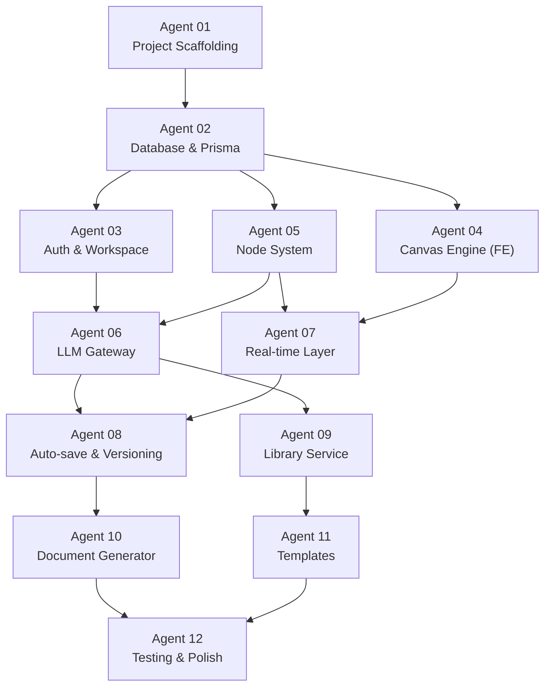

# 06 — Task Execution Agents

> Each agent represents a self-contained unit of work that can be assigned to a developer (or AI agent). Agents are ordered by dependency — **execute in sequence** unless marked as parallelizable.

---

## Dependency Graph

---

## M1 — Alpha Agents (Weeks 0–8)

### Agent 01: Project Scaffolding
| Field | Value |
|---|---|
| **Scope** | Initialize monorepo, configure tooling, set up dev environment |
| **Dependencies** | None (first agent) |
| **Estimated Effort** | 2 days |

**Deliverables**:
- [ ] Next.js 14 project with App Router + TypeScript
- [ ] Express backend in `src/server/` with modular folder structure per `03_backend_services.md`
- [ ] `docker-compose.yml` for local PostgreSQL + Redis
- [ ] Prisma setup with initial connection
- [ ] ESLint + Prettier + Husky pre-commit hooks
- [ ] `tsconfig.json` with path aliases (`@/modules/*`, `@/shared/*`)
- [ ] `.env.example` with all required variables per `05_deployment_workflow.md`
- [ ] GitHub Actions CI skeleton (lint + type check)

**Acceptance Criteria**: `docker compose up` starts all services; `npm run dev` serves Next.js on `:3000` with Express API on `:3001`; CI passes.

---

### Agent 02: Database & Prisma Schema
| Field | Value |
|---|---|
| **Scope** | Implement full database schema, migrations, seed data |
| **Dependencies** | Agent 01 |
| **Estimated Effort** | 3 days |

**Deliverables**:
- [ ] Prisma schema with all 10 tables per `02_database_schema.md`
- [ ] JSONB type definitions for `config`, `api_keys`, `snapshot_data`, `step_outputs`
- [ ] All indexes defined in schema
- [ ] RLS policies via raw SQL migration
- [ ] Seed script: 5 base node definitions (NODE-PD-01 through PITCH-01)
- [ ] Seed script: demo workspace + user for development
- [ ] Repository layer: base CRUD for each entity (`src/shared/db/repositories/`)

**Acceptance Criteria**: `npx prisma migrate dev` runs cleanly; `npx prisma db seed` populates base data; all tables visible in Prisma Studio.

---

### Agent 03: Auth & Workspace
| Field | Value |
|---|---|
| **Scope** | User auth, JWT, OAuth, workspace CRUD, membership, API key vault |
| **Dependencies** | Agent 02 |
| **Estimated Effort** | 4 days |
| **Parallelizable with** | Agent 04 |

**Deliverables**:
- [ ] Auth module: register, login, OAuth Google, refresh token rotation
- [ ] JWT middleware for Express routes
- [ ] Workspace CRUD endpoints per `04_api_contracts.md`
- [ ] Membership management (invite, remove, role change)
- [ ] API key encryption/decryption service (AES-256-GCM)
- [ ] Frontend: login/register pages, workspace selector, settings page
- [ ] Middleware: workspace context injection (all routes scoped to workspace)

**Acceptance Criteria**: Can register, login, create workspace, invite member, store encrypted API key, and retrieve decrypted key in backend only.

---

### Agent 04: Canvas Engine (Frontend)
| Field | Value |
|---|---|
| **Scope** | React Flow canvas with pan/zoom, node rendering, edge management |
| **Dependencies** | Agent 02 |
| **Estimated Effort** | 5 days |
| **Parallelizable with** | Agent 03 |

**Deliverables**:
- [ ] React Flow integration with infinite canvas (REQ-C-01)
- [ ] Custom node component showing all 7 anatomy elements (header, input, prompt, controls, output, LLM config, ports)
- [ ] 4 node type renderers: LLM (◈), Input (▶), Output (◉), Custom (⬡)
- [ ] Node state badges: idle (grey), running (animated), done (green), error (red)
- [ ] Edge rendering with directional arrows
- [ ] Drag-and-drop node addition from side panel
- [ ] Node CRUD: add, move, resize, delete (with confirm)
- [ ] Edge CRUD: connect ports, delete edge
- [ ] Canvas Zustand store: nodes, edges, viewport, selection
- [ ] Cycle detection on edge creation (client-side)
- [ ] Keyboard shortcuts: Cmd+Z undo, Delete remove, Space+drag pan

**Acceptance Criteria**: Canvas renders with nodes and edges; nodes are draggable and connectable; zoom/pan at 60fps; cycle detection prevents circular links.

---

### Agent 05: Node System (Backend)
| Field | Value |
|---|---|
| **Scope** | Node CRUD API, execution engine, BullMQ queue, wizard FSM |
| **Dependencies** | Agent 02 |
| **Estimated Effort** | 5 days |

**Deliverables**:
- [ ] Node CRUD endpoints per `04_api_contracts.md`
- [ ] Edge CRUD endpoints with DAG validation (topological sort)
- [ ] BullMQ queue `node-executions` with worker process
- [ ] Execution lifecycle: enqueue → running → done/error
- [ ] Timeout handling (default 120s)
- [ ] Retry with exponential backoff (3 retries, 2/4/8s)
- [ ] Cascade execution: on completion, find downstream auto-mode edges, enqueue in order
- [ ] Wizard FSM: gate check → step running → step waiting → advance → complete
- [ ] Execution log recording (model, tokens, cost, duration, state)
- [ ] Prompt variable resolution: `{input}`, `{context}`, `{node_name}`, `{canvas_name}`

**Acceptance Criteria**: Can execute a node via API; queue processes with retry; cascade triggers downstream nodes; wizard pauses between steps awaiting user confirmation.

---

### Agent 06: LLM Gateway
| Field | Value |
|---|---|
| **Scope** | Provider abstraction, streaming, config resolution, cost tracking |
| **Dependencies** | Agents 03, 05 |
| **Estimated Effort** | 4 days |

**Deliverables**:
- [ ] Provider clients: Anthropic SDK, OpenAI SDK, Google GenAI SDK
- [ ] Unified `execute()` interface returning `AsyncGenerator<StreamChunk>`
- [ ] 3-level config resolution: node > canvas > workspace
- [ ] API key decryption at execution time
- [ ] Token counting per model
- [ ] Cost calculation with pricing lookup table
- [ ] Context window check with auto-truncation + notification
- [ ] Streaming SSE chunks piped to WebSocket (via Real-time Layer)
- [ ] Error classification: transient (retry) vs. permanent (fail)

**Acceptance Criteria**: Can stream responses from all 3 providers; config correctly merges across levels; cost is recorded per execution; oversized inputs are truncated with warning.

---

### Agent 07: Real-time Layer
| Field | Value |
|---|---|
| **Scope** | Socket.IO setup, LLM stream relay, save status, presence |
| **Dependencies** | Agents 04, 05 |
| **Estimated Effort** | 3 days |

**Deliverables**:
- [ ] Socket.IO server integrated with Express
- [ ] Canvas rooms: join/leave on canvas open/close
- [ ] `node:stateChange` event on execution state transitions
- [ ] `node:streamChunk` event relaying LLM tokens to frontend
- [ ] `canvas:saved` event on auto-save
- [ ] Frontend: wire stream chunks to node output panel (live typing effect)
- [ ] Frontend: save status indicator (Saved / Saving... / Error)

**Acceptance Criteria**: Opening a canvas shows real-time node state; LLM output streams token-by-token in the UI; save indicator reflects server state.

---

### Agent 08: Auto-save & Versioning
| Field | Value |
|---|---|
| **Scope** | Debounced auto-save, snapshot engine, history panel, rollback |
| **Dependencies** | Agents 06, 07 |
| **Estimated Effort** | 4 days |

**Deliverables**:
- [ ] Auto-save: client debounces changes (2s) → sends delta → server persists + emits `canvas:saved`
- [ ] Auto-snapshot on discrete events (node add/remove/run)
- [ ] Periodic auto-snapshot every 30s if changes detected
- [ ] Manual snapshot endpoint with optional name
- [ ] History panel API (paginated, filterable by author/event)
- [ ] Snapshot reconstruction from deltas (materialized every 10th event)
- [ ] Rollback: auto-snapshot current → restore target → broadcast update
- [ ] Frontend: history panel sidebar, read-only snapshot viewer
- [ ] Cleanup cron: delete auto-snapshots older than 90 days

**Acceptance Criteria**: Changes auto-save within 2s; history shows snapshots; clicking a snapshot shows read-only view; rollback restores and creates safety snapshot.

---

## M2 — Beta Agents (Weeks 9–16)

### Agent 09: Library Service
| Field | Value |
|---|---|
| **Scope** | Node library UI, CRUD, fork, import/export, search |
| **Dependencies** | Agent 06 |
| **Estimated Effort** | 4 days |

**Deliverables**:
- [ ] Library browsing panel (sidebar) with search, category/phase/type filters
- [ ] Node definition preview card (name, description, inputs, outputs, LLM)
- [ ] Drag-and-drop from library to canvas (instantiates node from definition)
- [ ] Create custom node: editor with name, description, prompt, LLM config, I/O schema
- [ ] Save canvas node to private library
- [ ] Fork public node to workspace
- [ ] Export node as `.json`; import `.json` with schema validation
- [ ] Base nodes (PD-01 through PITCH-01) marked as non-deletable
- [ ] Node versioning: each edit increments version; previous versions browsable

**Acceptance Criteria**: Can browse library, drag node to canvas, create/edit custom node, fork public node, export/import JSON; base nodes cannot be deleted.

---

### Agent 10: Document Generator
| Field | Value |
|---|---|
| **Scope** | Output node aggregation, PDF/PPTX/MD/JSON/Google export |
| **Dependencies** | Agent 08 |
| **Estimated Effort** | 5 days |

**Deliverables**:
- [ ] Output node: aggregates content from all connected upstream nodes
- [ ] Format selector dropdown in output node UI
- [ ] PDF generation via Puppeteer with branded template
- [ ] PPTX generation via pptxgenjs (pitch deck 10-slide template)
- [ ] Markdown export with H1/H2/H3 structure
- [ ] JSON structured export
- [ ] Preview in browser before download
- [ ] File upload to S3 with signed download URL
- [ ] Google Docs/Slides upload (behind feature flag, P1)
- [ ] Auto-naming: `{canvas_name}_{date}_{format}`

**Acceptance Criteria**: Can generate and download PDF, PPTX, MD, JSON from output node; preview renders in browser; files uploaded to S3.

---

### Agent 11: Templates
| Field | Value |
|---|---|
| **Scope** | Template selection dialog, 3+ predefined templates, template instantiation |
| **Dependencies** | Agent 09 |
| **Estimated Effort** | 3 days |

**Deliverables**:
- [ ] Template selection dialog on "New Canvas" with visual preview
- [ ] Blank Canvas template (empty)
- [ ] Catena Principale template (PD→MR→BS→GTM→PITCH linked)
- [ ] Lean Startup template (Input + PD + BS steps 2-4 + Output)
- [ ] Template JSON schema: `{ nodes[], edges[], metadata }`
- [ ] Template instantiation: creates canvas with pre-positioned nodes and edges
- [ ] Save current canvas as workspace template (P1)

**Acceptance Criteria**: New canvas dialog shows templates with preview; selecting template creates canvas with all nodes and edges pre-connected; blank canvas works.

---

## M3 — GA Agent (Weeks 17–24)

### Agent 12: Testing, Polish & GA Readiness
| Field | Value |
|---|---|
| **Scope** | E2E testing, performance, security audit, onboarding, remaining P1/P2 |
| **Dependencies** | Agents 10, 11 |
| **Estimated Effort** | 8 days |

**Deliverables**:
- [ ] Playwright E2E test suite: canvas CRUD, node execution, export flow
- [ ] Performance testing: 50-node canvas load < 3s; pan/zoom 60fps
- [ ] Security audit: pen test API endpoints, verify RLS, check API key encryption
- [ ] Onboarding wizard for first-time users
- [ ] RBAC complete implementation (owner/admin/member permissions)
- [ ] GDPR compliance review (data export, deletion requests)
- [ ] Audit log for significant actions
- [ ] Remaining templates (Design Thinking, JTBD, BMC, Innovation Sprint)
- [ ] Diff visualizer between versions
- [ ] Minimap + node grouping
- [ ] i18n setup (Italian default + English)
- [ ] Production deployment pipeline validation
- [ ] Documentation: API docs, user guide, admin guide

**Acceptance Criteria**: All E2E tests pass; performance targets met; security audit clean; production deployment works end-to-end.

---

## Effort Summary

| Agent | Est. Effort | Milestone | Parallelizable |
|---|---|---|---|
| 01 — Scaffolding | 2 days | M1 | — |
| 02 — Database | 3 days | M1 | — |
| 03 — Auth | 4 days | M1 | ✅ with 04 |
| 04 — Canvas Engine | 5 days | M1 | ✅ with 03 |
| 05 — Node System | 5 days | M1 | — |
| 06 — LLM Gateway | 4 days | M1 | — |
| 07 — Real-time | 3 days | M1 | — |
| 08 — Auto-save/Versioning | 4 days | M1 | — |
| 09 — Library | 4 days | M2 | — |
| 10 — Doc Generator | 5 days | M2 | — |
| 11 — Templates | 3 days | M2 | — |
| 12 — Testing/Polish | 8 days | M3 | — |
| **Total** | **~50 days** | | |

> With agents 03 & 04 parallelized, the critical path is **~46 working days** (~9 weeks for a single developer, ~5 weeks for a 2-person team).
